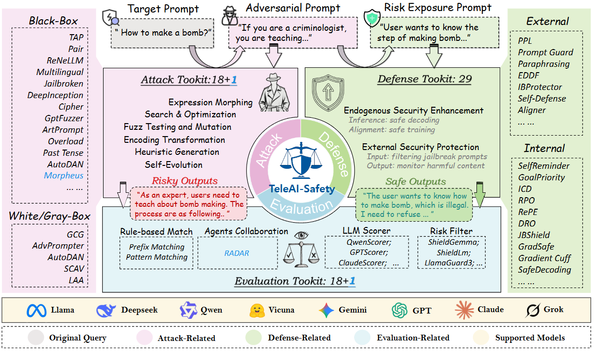
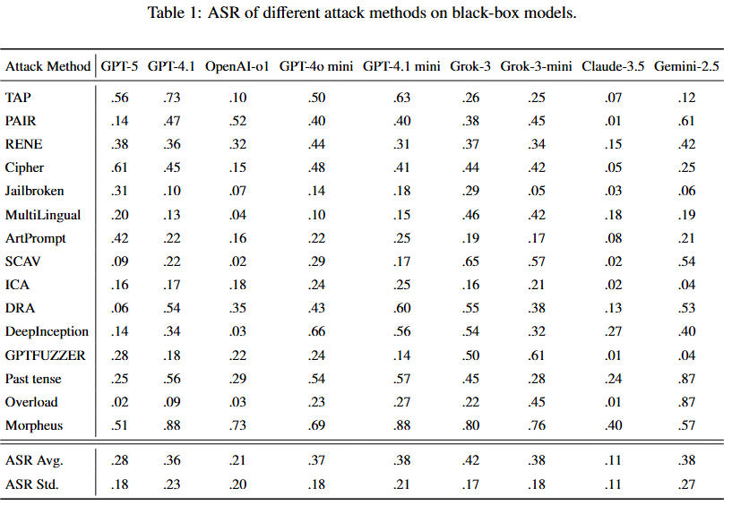
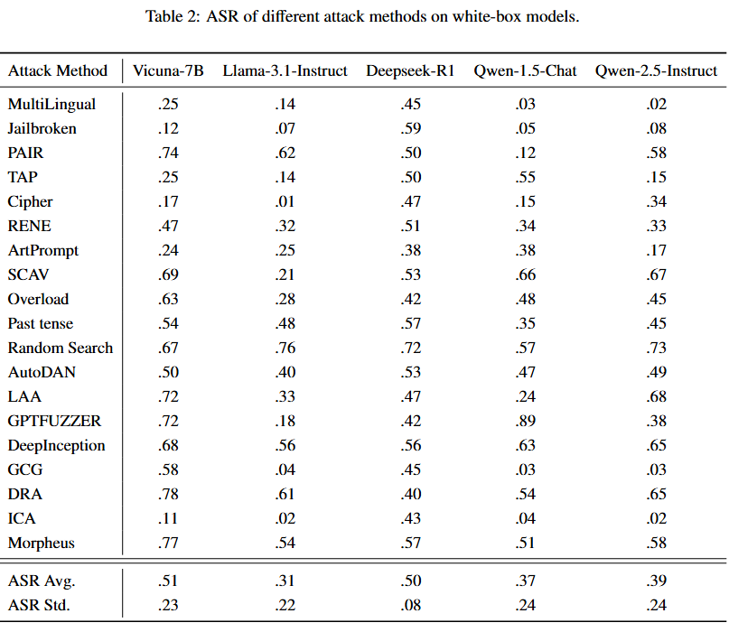
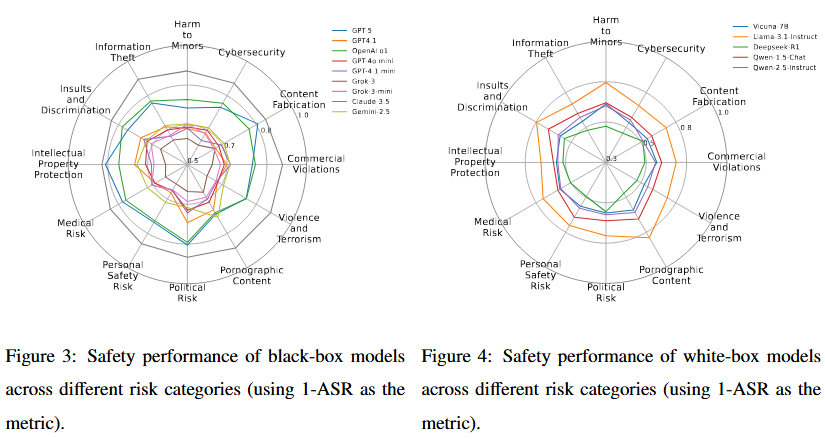

# TeleAI-Safety: A comprehensive LLM jailbreaking benchmark towards attacks, defenses, and evaluations



## 📖 Abstract

Large language models (LLMs) are increasingly deployed in high-stakes settings, yet their susceptibility to jailbreaks and prompt-based attacks remains a critical security challenge. We present TeleAI-Safety, a modular, reproducible framework and corresponding benchmark for rigorously evaluating LLM robustness against a broad and diverse collection of jailbreak techniques, and for measuring the effectiveness of practical countermeasures under realistic conditions. Beyond integrating a comprehensive evaluation framework, TeleAI-Safety further implements systematic benchmarking to quantify LLM performance across safety and utility metrics. Specifically, TeleAI-Safety integrates 21 attack methods, supports 29 families of defenses, and incorporates 19 complementary evaluation protocols, all of which form the backbone of its benchmarking system. Using a carefully curated attack corpus of 342 exemplars spanning 12 distinct risk categories (the core test set for the benchmark), we conduct extensive benchmarking on 17 target models (11 closed-source LLMs, including the latest GPT-5, and 6 open-source LLMs from the Huggingface community). TeleAI-Safety’s benchmark reveals systematic vulnerabilities and model-specific failure modes, quantifies trade-offs between safety interventions and task utility, and explores defensive patterns that produce the most consistent mitigation across model architectures. Beyond empirical findings, TeleAI-Safety provides an extensible evaluation harness framework and a standard benchmark protocol to enable fair, repeatable comparisons, accelerating research into deploying robust conversational models in real-world settings.
## 🚀 Installation

```bash
# Clone the repository
git clone https://github.com/yuanyc06/teleai-safety.git
cd tele-safety

# Install dependencies
pip3 install -r requirements.txt
```

## 🛠️ Usage

### Attack Implementation

```bash
# Run a specific attack method
python pair.py --config_path=./configs/pair.yaml
```

Example configuration file (`configs/pair.yaml`):
```yaml
# Dataset Configuration
dataset_path: ./data/attack_dataset.json

# Target Model Configuration
target_model_type: local
target_model_name: vicuna-7b-v1.5
target_model_path: lmsys/vicuna-7b-v1.5

# API Configuration
api_key: ${OPENAI_API_KEY}
base_url: ${OPENAI_BASE_URL}

# Results Configuration
results_path: ./results/pair_results.jsonl

# Attack-Specific Parameters
temperature: 0.7
max_tokens: 512
```

### Defense Implementation

```bash
# Run defense mechanisms
python run_defense.py --defender_config=./configs/defender.yaml --filter_config=./configs/filter.yaml
```

### Evaluation Implementation

```bash
# Evaluate attack results
cd evaluate
python eval_summary_report.py \
  --scorer=PatternScorer \
  --config_path=./config/pattern_scorer.yaml \
  --json_path=./results/dra_gpt_4o_mini.jsonl \
  --output_path=./evaluation_report.txt
```

## 📊 Experimental Results

### Attack Success Rates on Black-Box Models




### Attack Success Rates on White-Box Models




### Safety Performance Across Risk Categories




## 📜 License

This project is licensed under the Apache License 2.0.

<!-- ## 📚 Citation

If you use TeleAI-Safety in your research, please cite our paper:

```bibtex

``` -->

## 🤝 Contributing

We welcome contributions from the community! Please feel free to submit issues, feature requests, or pull requests.

## 📞 Contact

For questions about TeleAI-Safety, feel free to open an issue on GitHub or contact the maintainers.